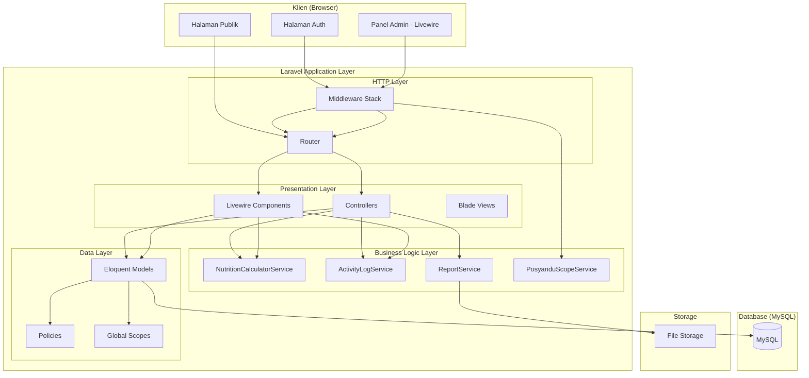
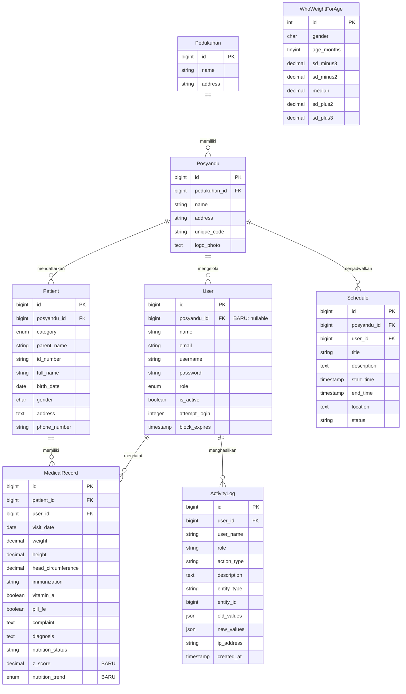
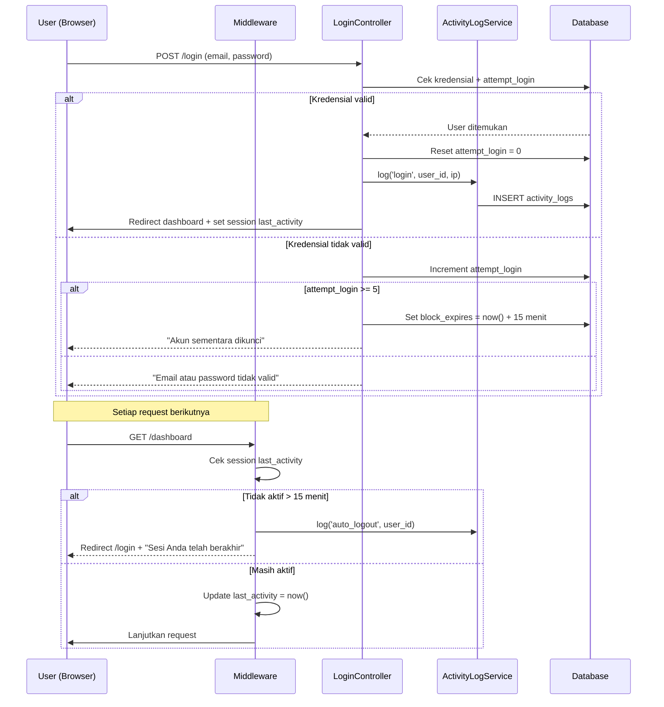
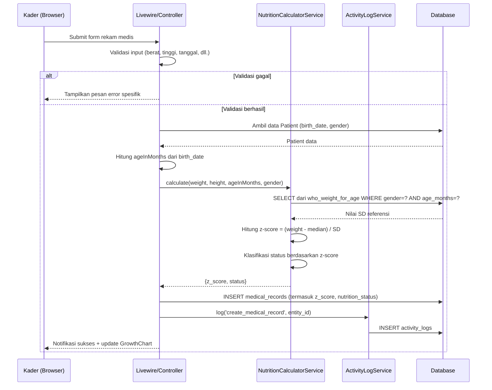
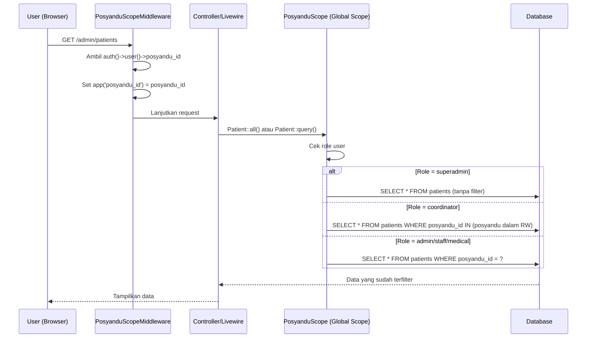
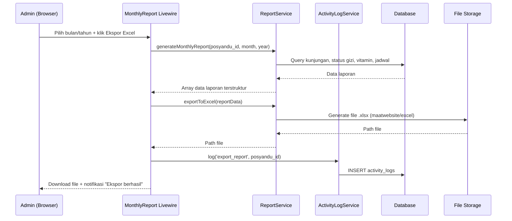

# Dokumen Desain Teknis
## Fitur: Penyesuaian Sistem Posyandu (posyandu-system-alignment)


## Overview

Dokumen ini menjabarkan desain teknis untuk penyesuaian sistem `posyandu-admin-dashboard` agar sepenuhnya sesuai dengan SRS Sistem Pengelolaan Data Posyandu Bekasi Timur. Sistem dibangun di atas fondasi Laravel 12 + Livewire Flux v2 + Tailwind CSS yang sudah ada, dengan penambahan komponen-komponen baru untuk memenuhi kesenjangan fungsional yang teridentifikasi.

### Tujuan Desain

1. Memperkuat kontrol akses berbasis role (RBAC) dengan scoping data per unit posyandu
2. Menambahkan audit trail melalui sistem log aktivitas
3. Mengimplementasikan kalkulasi status gizi otomatis sesuai standar WHO/Kemenkes
4. Menyediakan visualisasi grafik pertumbuhan Balita
5. Menghasilkan laporan bulanan yang dapat diekspor ke Excel dan PDF
6. Menyediakan halaman publik yang informatif tanpa memerlukan autentikasi
7. Memastikan antarmuka ramah pengguna untuk kader berusia 50+

### Batasan Desain

- Tidak mengubah struktur model data inti yang sudah ada (`Patient`, `MedicalRecord`, `User`, `Posyandu`, dll.)
- Menggunakan library yang sudah terinstall (`barryvdh/laravel-dompdf`) dan menambahkan `maatwebsite/excel`
- Menggunakan PestPHP v3 untuk semua pengujian
- Fitur offline (Persyaratan 16) adalah opsional Phase 2 dan tidak termasuk dalam desain ini

---

## Architecture

### Arsitektur High-Level



### Pola Arsitektur

Sistem menggunakan pola **MVC + Service Layer** dengan Livewire untuk komponen interaktif:

- **Controllers**: Menangani request HTTP, validasi input, dan delegasi ke service
- **Livewire Components**: Komponen UI reaktif untuk interaksi real-time (dashboard, grafik, form)
- **Service Classes**: Logika bisnis yang dapat diuji secara independen (kalkulasi gizi, log aktivitas, laporan)
- **Eloquent Models + Policies**: Akses data dengan otorisasi berbasis policy
- **Global Scopes**: Pembatasan data otomatis berdasarkan `posyandu_id` pengguna

### Middleware Stack

```
Request
  └── Authenticate (cek login)
      └── CheckUserStatus (cek is_active & block_expires)
          └── SessionTimeout (cek last_activity 15 menit)
              └── PosyanduScopeMiddleware (set posyandu context)
                  └── RoleMiddleware (cek role)
                      └── Controller/Livewire
```

---

## Components and Interfaces

### 1. Middleware Baru

#### `SessionTimeout` Middleware
```php
// app/Http/Middleware/SessionTimeout.php
// Cek session('last_activity'), jika > 15 menit → logout + redirect login
// Update session('last_activity') = now() pada setiap request
```

#### `PosyanduScopeMiddleware` Middleware
```php
// app/Http/Middleware/PosyanduScopeMiddleware.php
// Set app('posyandu_id') = auth()->user()->posyandu_id
// Digunakan oleh Global Scope untuk filter otomatis
```

### 2. Service Classes Baru

#### `ActivityLogService`
```php
// app/Services/ActivityLogService.php
interface ActivityLogService {
    public function log(
        string $actionType,    // 'login', 'logout', 'create_patient', dll.
        string $description,
        ?int $entityId = null,
        ?string $entityType = null,
        ?array $oldValues = null,
        ?array $newValues = null
    ): ActivityLog;
}
```

#### `NutritionCalculatorService`
```php
// app/Services/NutritionCalculatorService.php
interface NutritionCalculatorService {
    // Hitung z-score BB/U menggunakan tabel WHO/Kemenkes
    public function calculateZScore(
        float $weight,       // kg
        int $ageInMonths,    // 0-59 bulan
        string $gender       // 'M' atau 'F'
    ): float;

    // Klasifikasi status gizi berdasarkan z-score
    public function classifyNutritionStatus(float $zScore): string;
    // Returns: 'Gizi Lebih' | 'Normal' | 'Gizi Kurang' | 'Gizi Buruk/Stunting'

    // Entry point utama: hitung dan klasifikasi sekaligus
    public function calculate(
        float $weight,
        float $height,
        int $ageInMonths,
        string $gender
    ): array; // ['z_score' => float, 'status' => string]
}
```

#### `ReportService`
```php
// app/Services/ReportService.php
interface ReportService {
    public function generateMonthlyReport(
        int $posyanduId,
        int $month,
        int $year
    ): array; // Data laporan terstruktur

    public function exportToExcel(array $reportData): string; // path file
    public function exportToPdf(array $reportData): string;   // path file
}
```

### 3. Livewire Components Baru

#### `AutoLogout` Component
```php
// app/Livewire/Shared/AutoLogout.php
// JavaScript timer 15 menit
// Livewire event 'session-expired' → redirect ke login
// Dipasang di layout utama admin
```

#### `GrowthChart` Component
```php
// app/Livewire/Admin/PatientManagement/GrowthChart.php
// Props: $patientId
// Mengambil data MedicalRecord untuk pasien
// Render Chart.js dengan data BB, TB, Lingkar Kepala per bulan
// Garis referensi WHO/Kemenkes
```

#### `DashboardStats` Component (update AdminDashboard)
```php
// app/Livewire/Admin/AdminDashboard.php (diperbarui)
// Statistik: total balita, ibu hamil, jadwal aktif, kunjungan bulan ini
// Daftar balita stunting
// Scoped berdasarkan role pengguna
```

#### `ActivityLogViewer` Component
```php
// app/Livewire/Admin/ActivityLogViewer.php
// Filter: rentang tanggal, jenis aksi, nama pengguna
// Pagination
// Hanya untuk superadmin dan admin
```

#### `MonthlyReport` Component
```php
// app/Livewire/Admin/Reports/MonthlyReport.php
// Pilih bulan/tahun
// Preview laporan
// Tombol ekspor Excel dan PDF
```

### 4. Controllers Baru

#### `ReportController`
```php
// app/Http/Controllers/Web/ReportController.php
public function index(): View
public function generate(Request $request): View
public function exportExcel(Request $request): BinaryFileResponse
public function exportPdf(Request $request): Response
```

#### `PublicController` (menggantikan/melengkapi PublicArticleController)
```php
// app/Http/Controllers/Web/PublicController.php
public function home(): View      // Halaman beranda publik
public function about(): View     // Tentang Kami
public function contact(): View   // Kontak
```

### 5. Policies Baru

```php
// app/Policies/PatientPolicy.php
// app/Policies/MedicalRecordPolicy.php
// app/Policies/ActivityLogPolicy.php
// app/Policies/ReportPolicy.php
```

### 6. Traits Baru

#### `LogsActivity` Trait
```php
// app/Traits/LogsActivity.php
// Di-attach ke model Patient, MedicalRecord
// Boot: created, updated, deleted → ActivityLogService::log()
// Menyimpan nilai lama (getOriginal()) dan baru (getChanges())
```

#### `ScopedByPosyandu` Trait
```php
// app/Traits/ScopedByPosyandu.php
// Menambahkan Global Scope ke model
// Filter otomatis berdasarkan posyandu_id pengguna yang login
// Dikecualikan untuk superadmin dan coordinator
```

---

## Data Models

### Perubahan Tabel yang Sudah Ada

#### Tabel `users` — Tambah Kolom
```sql
ALTER TABLE users
ADD COLUMN posyandu_id BIGINT UNSIGNED NULL,
ADD FOREIGN KEY (posyandu_id) REFERENCES posyandus(id) ON DELETE SET NULL;
```

**Catatan**: `posyandu_id` nullable karena superadmin tidak terikat ke satu posyandu.

#### Tabel `medical_records` — Tambah Kolom
```sql
ALTER TABLE medical_records
ADD COLUMN z_score DECIMAL(5,2) NULL COMMENT 'Z-score BB/U WHO/Kemenkes',
ADD COLUMN nutrition_trend ENUM('naik','turun','tetap') NULL COMMENT 'Tren vs bulan sebelumnya';
```

### Tabel Baru

#### Tabel `activity_logs`
```sql
CREATE TABLE activity_logs (
    id          BIGINT UNSIGNED AUTO_INCREMENT PRIMARY KEY,
    user_id     BIGINT UNSIGNED NOT NULL,
    user_name   VARCHAR(255) NOT NULL,
    role        VARCHAR(50) NOT NULL,
    action_type VARCHAR(100) NOT NULL,
    -- Nilai: 'login', 'logout', 'create_patient', 'update_patient',
    --        'delete_patient', 'create_medical_record', 'update_medical_record',
    --        'export_report', 'change_user_access', 'unauthorized_access'
    description TEXT NOT NULL,
    entity_type VARCHAR(100) NULL,  -- 'Patient', 'MedicalRecord', dll.
    entity_id   BIGINT UNSIGNED NULL,
    old_values  JSON NULL,          -- Nilai sebelum perubahan
    new_values  JSON NULL,          -- Nilai sesudah perubahan
    ip_address  VARCHAR(45) NOT NULL,
    created_at  TIMESTAMP NOT NULL DEFAULT CURRENT_TIMESTAMP,
    -- Tidak ada updated_at (immutable)

    INDEX idx_user_id (user_id),
    INDEX idx_action_type (action_type),
    INDEX idx_created_at (created_at),
    INDEX idx_entity (entity_type, entity_id),

    FOREIGN KEY (user_id) REFERENCES users(id) ON DELETE RESTRICT
);
```

**Catatan Desain**: Tabel ini tidak memiliki `updated_at` untuk menegakkan immutability. Penghapusan hanya diizinkan melalui scheduled job yang dijalankan oleh superadmin setelah 12 bulan.

#### Tabel `who_weight_for_age` (Tabel Referensi Z-Score)
```sql
CREATE TABLE who_weight_for_age (
    id          INT UNSIGNED AUTO_INCREMENT PRIMARY KEY,
    gender      CHAR(1) NOT NULL,       -- 'M' atau 'F'
    age_months  TINYINT UNSIGNED NOT NULL, -- 0-59
    sd_minus3   DECIMAL(5,2) NOT NULL,  -- -3 SD (Gizi Buruk)
    sd_minus2   DECIMAL(5,2) NOT NULL,  -- -2 SD (Gizi Kurang)
    median      DECIMAL(5,2) NOT NULL,  -- Median (Normal)
    sd_plus2    DECIMAL(5,2) NOT NULL,  -- +2 SD (Gizi Lebih)
    sd_plus3    DECIMAL(5,2) NOT NULL,  -- +3 SD

    UNIQUE KEY uk_gender_age (gender, age_months)
);
```

**Catatan**: Tabel ini diisi melalui seeder dari data resmi WHO/Kemenkes. Tidak perlu tabel terpisah untuk TB/U dan BB/TB pada fase ini — fokus pada BB/U sesuai Persyaratan 7.1.

### Diagram Relasi Entitas (ERD)



---

## Data Flow

### Alur 1: Login dan Auto-Logout



### Alur 2: Input Rekam Medis dan Kalkulasi Status Gizi



### Alur 3: Scoping Data Per Posyandu



### Alur 4: Ekspor Laporan Bulanan



---

## API / Routes Design

### Routes Publik (Tanpa Autentikasi)

```php
// Halaman beranda publik (BARU)
Route::get('/', [PublicController::class, 'home'])->name('public.home');

// Artikel (sudah ada, tetap)
Route::get('/articles', [PublicArticleController::class, 'index'])->name('public.articles.index');
Route::get('/articles/{slug}', [PublicArticleController::class, 'show'])->name('public.articles.show');

// Halaman statis (sudah ada, pindah ke PublicController)
Route::get('/about', [PublicController::class, 'about'])->name('public.about');
Route::get('/contact', [PublicController::class, 'contact'])->name('public.contact');
```

### Routes Admin Baru (Dengan Autentikasi)

```php
Route::middleware(['auth', 'check.user.status', 'session.timeout'])->group(function () {

    // Dashboard (update existing)
    Route::get('/dashboard', [DashboardController::class, 'index'])->name('dashboard');

    // Log Aktivitas (BARU)
    Route::middleware(['role:superadmin,admin'])->group(function () {
        Route::get('/admin/activity-logs', ActivityLogViewer::class)
             ->name('admin.activity-logs.index');
    });

    // Laporan Bulanan (BARU)
    Route::middleware(['role:superadmin,admin,coordinator'])->group(function () {
        Route::get('/admin/reports', [ReportController::class, 'index'])
             ->name('admin.reports.index');
        Route::post('/admin/reports/generate', [ReportController::class, 'generate'])
             ->name('admin.reports.generate');
        Route::post('/admin/reports/export-excel', [ReportController::class, 'exportExcel'])
             ->name('admin.reports.export-excel');
        Route::post('/admin/reports/export-pdf', [ReportController::class, 'exportPdf'])
             ->name('admin.reports.export-pdf');
    });

    // Routes yang sudah ada (patients, medical-records, dll.) tetap sama
    // dengan tambahan middleware posyandu.scope
});
```

### Middleware Registration (bootstrap/app.php)

```php
->withMiddleware(function (Middleware $middleware) {
    $middleware->alias([
        'role'            => RoleMiddleware::class,
        'superadmin'      => SuperadminMiddleware::class,
        'check.user.status' => CheckUserStatus::class,
        'session.timeout' => SessionTimeout::class,       // BARU
        'posyandu.scope'  => PosyanduScopeMiddleware::class, // BARU
    ]);
})
```

---

## Error Handling

### Strategi Penanganan Error

#### 1. Error Validasi (422 Unprocessable Entity)
- Semua validasi menggunakan Laravel Form Request (`PatientRequest`, `MedicalRecordRequest`, dll.)
- Pesan error dalam Bahasa Indonesia, spesifik, dan mudah dipahami
- Contoh: "NIK harus terdiri dari tepat 16 digit angka" bukan "The id_number field must be 16 characters"
- Livewire menampilkan error secara real-time tanpa reload halaman

#### 2. Error Otorisasi (403 Forbidden)
- Semua akses tidak sah ditangani oleh Policy dan Middleware
- Setiap 403 dicatat dalam `activity_logs` dengan `action_type = 'unauthorized_access'`
- Halaman error 403 yang ramah pengguna dalam Bahasa Indonesia

#### 3. Error Kalkulasi Gizi
- Jika data referensi WHO tidak ditemukan (usia di luar 0-59 bulan), kembalikan `null` untuk z_score
- `nutrition_status` diisi 'Tidak Dapat Dihitung' jika kalkulasi gagal
- Tidak melempar exception yang menghentikan penyimpanan rekam medis

#### 4. Error Ekspor Laporan
- Jika ekspor gagal, tampilkan pesan "Ekspor gagal. Silakan coba lagi." (tanpa detail teknis)
- Catat error detail di Laravel log (`storage/logs/laravel.log`)
- Tidak mencatat kegagalan ekspor di `activity_logs` (hanya ekspor berhasil yang dicatat)

#### 5. Error Auto-Logout
- Jika session tidak dapat dibaca, arahkan ke login dengan pesan generik
- Livewire `AutoLogout` component menggunakan JavaScript timer sebagai fallback jika server-side check gagal

#### 6. Error Backup (Persyaratan 15.4)
- Backup otomatis menggunakan Laravel Scheduler
- Jika gagal, catat di `storage/logs/backup.log` dan kirim notifikasi email ke superadmin
- Implementasi menggunakan `spatie/laravel-backup` atau custom artisan command

### Kode Error HTTP yang Digunakan

| Kode | Kondisi |
|------|---------|
| 400  | Request tidak valid (format salah) |
| 401  | Belum login |
| 403  | Tidak memiliki izin (role/posyandu salah) |
| 404  | Data tidak ditemukan |
| 422  | Validasi gagal |
| 500  | Error server internal |

---

## Testing Strategy

### Pendekatan Pengujian Ganda

Sistem menggunakan dua lapisan pengujian yang saling melengkapi:

1. **Unit/Feature Tests** (PestPHP): Menguji contoh spesifik, edge case, dan integrasi komponen
2. **Property-Based Tests** (PestPHP + arsitektur manual): Menguji properti universal yang berlaku untuk semua input valid

### Struktur Direktori Test

```
tests/
├── Unit/
│   ├── Services/
│   │   ├── NutritionCalculatorServiceTest.php  ← Property tests utama
│   │   ├── ActivityLogServiceTest.php
│   │   └── ReportServiceTest.php
│   └── Models/
│       └── PatientTest.php
├── Feature/
│   ├── Auth/
│   │   ├── LoginTest.php
│   │   └── AutoLogoutTest.php
│   ├── Admin/
│   │   ├── PatientManagementTest.php
│   │   ├── MedicalRecordTest.php
│   │   ├── ActivityLogTest.php
│   │   └── ReportTest.php
│   └── Public/
│       └── PublicPageTest.php
└── Pest.php
```

### Konfigurasi Property-Based Testing

Karena PestPHP v3 tidak memiliki library PBT bawaan, property-based tests diimplementasikan menggunakan **generator functions** dan **data providers** dengan minimal 100 iterasi:

```php
// Contoh pola property test di PestPHP
it('mengklasifikasikan z-score secara konsisten', function () {
    // Jalankan 100 iterasi dengan input acak
    for ($i = 0; $i < 100; $i++) {
        $zScore = fake()->randomFloat(2, -5.0, 5.0);
        $service = new NutritionCalculatorService();

        $result1 = $service->classifyNutritionStatus($zScore);
        $result2 = $service->classifyNutritionStatus($zScore);

        // Property: deterministik — input sama selalu menghasilkan output sama
        expect($result1)->toBe($result2);
    }
})->repeat(1); // Tag: Feature: posyandu-system-alignment, Property 1
```

### Unit Tests Prioritas

| Komponen | Test Utama |
|----------|-----------|
| `NutritionCalculatorService` | Kalkulasi z-score, klasifikasi status, deterministik |
| `ActivityLogService` | Log dibuat untuk setiap aksi kritis, atribut lengkap |
| `PosyanduScopeMiddleware` | Scoping data per role |
| `SessionTimeout` | Auto-logout setelah 15 menit tidak aktif |
| `ReportService` | Data laporan konsisten dengan database |
| `PatientPolicy` | Otorisasi CRUD per role dan posyandu |

### Feature Tests Prioritas

| Fitur | Test Utama |
|-------|-----------|
| Login/Logout | Autentikasi, blokir 5x gagal, log aktivitas |
| Manajemen Sasaran | Validasi NIK, scoping posyandu, log perubahan |
| Rekam Medis | Validasi rentang, kalkulasi gizi otomatis |
| Ekspor Laporan | Akses role, file dihasilkan, log aktivitas |
| Halaman Publik | Akses tanpa login, tidak ada data pribadi |

